<!-- HEADER -->

 

<!-- ═══ LIVE TERMINAL & PORTRAIT ═══ -->
<table>
  <tr>
    <td valign="top" align="center"></td>
    <td valign="top" align="center"></td>
  </tr>
</table>

 

<!-- ═══ WHAT I'VE BUILT ═══ -->

 

| # | Project | Repository | Live Link |
|:--|:--------|:-----------|:----------|
| 01 | **Lens Shtar** — Privacy-first AI expense analyzer & bank statement insights | [github.com/Akshat-xe/Lens-Shtar](https://github.com/Akshat-xe/Lens-Shtar) | [lens.shtar.space](https://lens.shtar.space) |
| 02 | **Ever Shtar** — Digital studio: websites, automation & AI products | [github.com/Akshat-xe/Ever-Shtar](https://github.com/Akshat-xe/Ever-Shtar) | [evershtar.shtar.space](https://evershtar.shtar.space) |
| 03 | **Indo Investor Infra World** — Premium real estate platform, Noida · Jewar · Dholera | [github.com/Akshat-xe/Indo-Investor-Infra-World](https://github.com/Akshat-xe/Indo-Investor-Infra-World) | [indoinvestor.shtar.space](https://indoinvestor.shtar.space) |
| 04 | **Love Over Coffee** — Premium vegetarian cafe website, Indore | [github.com/Akshat-xe/Love-Over-Coffee](https://github.com/Akshat-xe/Love-Over-Coffee) | [loveovercoffee.shtar.space](https://loveovercoffee.shtar.space) |
| 05 | **Orah Cafe** — Modern cafe experience website, Perth AU | [github.com/Akshat-xe/Orah-Cafe](https://github.com/Akshat-xe/Orah-Cafe) | [orahcafe.shtar.space](https://orahcafe.shtar.space) |
| 06 | **Arvind Canteen** — Traditional eatery est. 1956, Barharwa Jharkhand | [github.com/Akshat-xe/Arvind-Canteen-Barharwa](https://github.com/Akshat-xe/Arvind-Canteen-Barharwa) | [arvindcafe.shtar.space](https://arvindcafe.shtar.space) |
| 07 | **Angira's Radiant Diet Plan** — Bilingual mobile-first wellness app | [github.com/Akshat-xe/Angira-Radiant-Diet-Plan](https://github.com/Akshat-xe/Angira-Radiant-Diet-Plan) | [angira-diet.shtar.space](https://angira-diet.shtar.space) |
| 08 | **Kaya Remedies** — Modern botanical & natural remedy library | [github.com/Akshat-xe/Kaya-Remedies-Shtar](https://github.com/Akshat-xe/Kaya-Remedies-Shtar) | [kaya-remedies.shtar.space](https://kaya-remedies.shtar.space/) |
| 09 | **Portfolio** — Personal portfolio & showcase codebase | [github.com/Akshat-xe/Portfolio](https://github.com/Akshat-xe/Portfolio) | [akshat.shtar.space](https://akshat.shtar.space) |
| 10 | **Nihshreyasa Vidyapeeth** — Educational & cultural portal | [github.com/Akshat-xe/Nihshreyasa-Vidyapeeth](https://github.com/Akshat-xe/Nihshreyasa-Vidyapeeth) | [nv.shtar.space](https://nv.shtar.space) |

<!-- ═══ ARSENAL ═══ -->

<!-- ═══ THE BUILDER ═══ -->

 

  

 

<!-- ═══ EDUCATION ═══ -->

 

  

 

<!-- ═══ GITHUB STATS ═══ -->

 

<!-- ═══ LEETCODE STATS ═══ -->

 

 

<!-- ═══ CONNECT ═══ -->

 

> *"No walls, no limits, no boundaries to tame.*  
> *Ever SHTAR rises, a forge of relentless flame.*  
> *One mind, one flow, automation in motion.*  
> *Built not for fame — but to spark pure devotion."*

<!-- FOOTER -->

